Workshops
=========
The purpose of this list of workshop descriptions is to provide the organizers of the trip with a sort of toolbox, from which they can pick activities that will suit the situation and the group of children.

Quiz
----
In order to get acquainted with the ship, find the names of all the elements on the drawing. A good starting exercise.

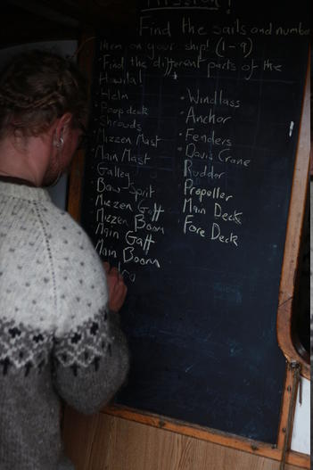

Learnings: vocabulary

Climb the mast
--------------
Climb to the top of the mast (wearing climbing equipment and being secured with a line)

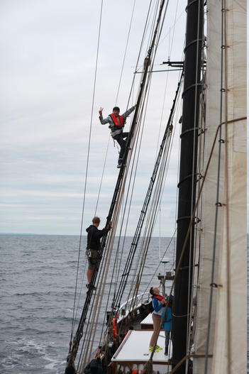

Learnings: motor skills, overcoming fear of heights

Dish washing
------------
Using salt water, rinse the dishes. Then wash and rinse them with a little fresh water.

Pull water from the see using a bucket.

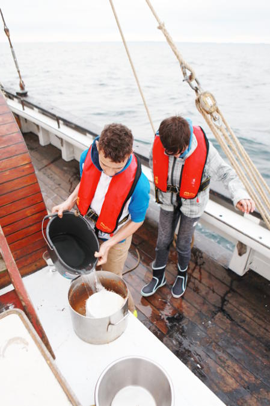

Learnings: share the chores, motor skills

Steer the helm
--------------
Keep a given course. Unless the horizon is empty, use pointers on the horizon to navigate, it's more precise than the compass.

Learnings: learn to read a compass, understand the ship's momentum

Morning/evening swim
--------------------
Before or after the sailing, arrange a swim around, or under, the ship.

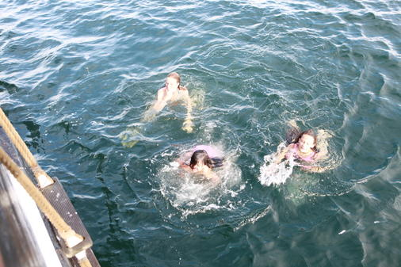

Learnings: lots of fun. Learn to swim and dive. Get confident in the water.

Working with the sails
----------------------
A lot of activity occurs when maneuvering the vessel, e.g. hoisting the sails, coiling, etc.

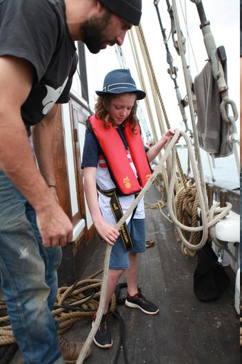

Learnings: operate the vessel, many mechanical aspects.

Tarzan in the ropes
-------------------
Set up one or more ropes that the children can swing around in, possibly into the water

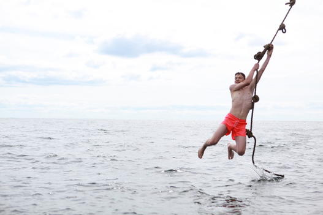

Learnings: motor skills and physical training.

Zodiac
------
Steer the zodiac. Look far ahead to keep the course.

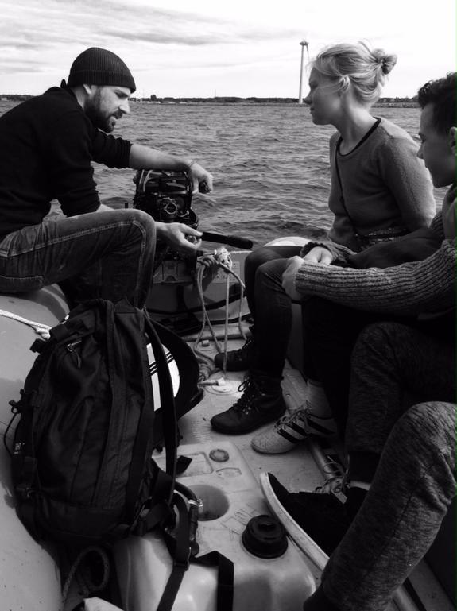

Learnings: steering a small vessel. Understand how the engine works.

Knot work
---------
Bow line, dobbelt halsstik, noeud de huit, +2. Perhaps also other knots.

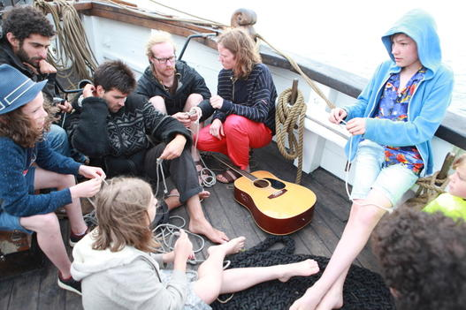

Learnings: useful knots.

Splicing
--------
Splice two ropes together.

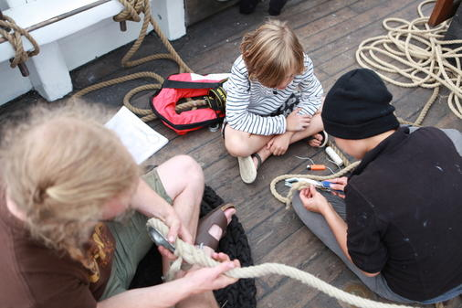

Learnings: how ropes work, splicing.

Hoist the anchor
----------------
A quite physical and stamina-demanding exercise.

Learnings: how an anchor and chain work, physical training.

Bearing planning, passage planning (advanced?)
----------------------------------------------
Plan the trajectory using a (paper) map.

Learnings: geography, vector arithmetic

Fishing
-------
Catch some fish for dinner. 

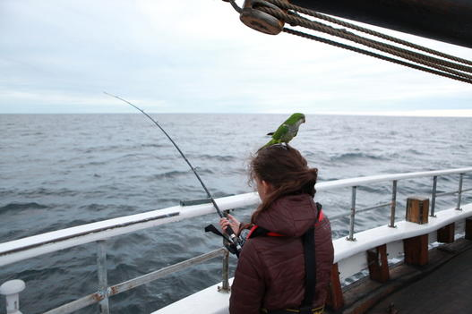

Learnings: fishing

Challenges
==========
The children generally enjoy pushing their limits and tend to invent challenges on their own.

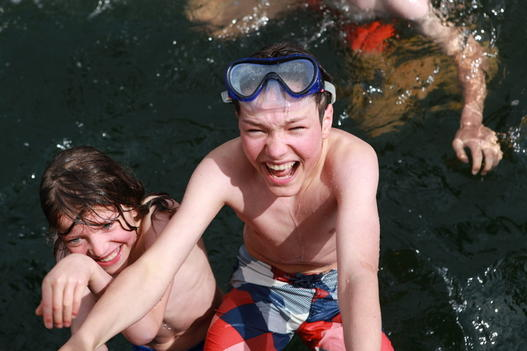

Here are some examples

Jump challenges
---------------
from the rail
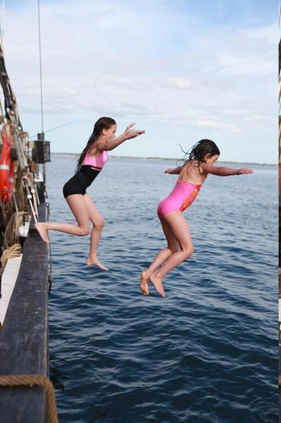

from the  shrouds level 3, level 4
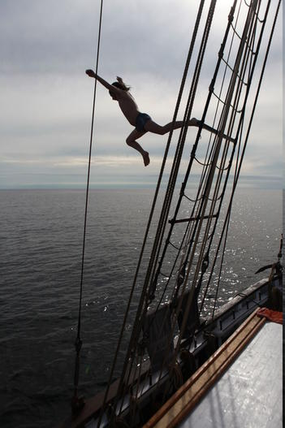

from the roof
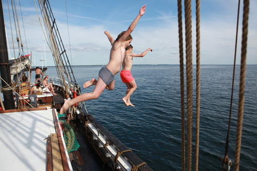

Climbing challenges
-------------------
Chain challenge: climb up into the shark nest from the chain
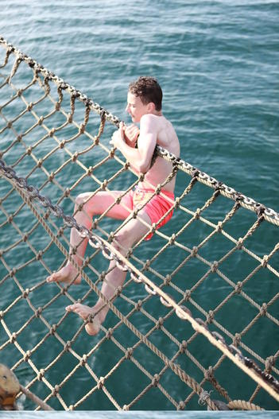

Mast: Climb to the highest accessible point on the mast
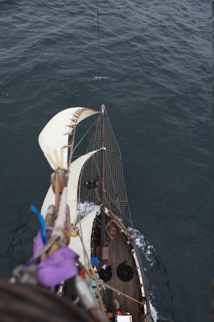

 
Diving
------
 * under the hull: Swim under the hull of the ship
 * to the bottom: Swim down to the bottom of the sea (and up again)
 
